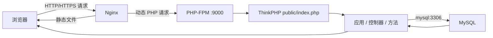

# PHP 管理系统学习与部署笔记

> 项目仓库：`gaoshuteng7-art/php-management-system`
>
> 整理日期：2026-07-24
> 目标：记录从课程作业到可部署项目所掌握的核心知识、操作流程和排错方法。

## 1. 项目整体认识

这是一个基于 ThinkPHP 的 PHP 管理系统。项目使用 Nginx 接收 HTTP/HTTPS 请求，使用 PHP-FPM 执行 PHP，使用 MySQL 保存业务数据，并用 Docker Compose 管理这些服务。



完整请求链路：

```text
浏览器 → Nginx → PHP-FPM → public/index.php → ThinkPHP 路由
       → 应用 → 控制器 → 方法 → MySQL → 响应
```

例如 `/admin/login/index` 可以理解为：

- `admin`：应用（后台模块）。
- `login`：控制器。
- `index`：控制器中的公开方法。
- `public/index.php`：整个 ThinkPHP Web 应用的统一入口，不是最终业务页面。

## 2. MVC 与各模块作用

MVC 把代码职责分开：

- Model（模型）：处理数据和数据库访问。
- View（视图）：向用户展示 HTML 页面。
- Controller（控制器）：接收请求、调用业务逻辑并选择响应。

在这个项目中，浏览器不会直接执行控制器。请求先进入 `public/index.php`，ThinkPHP 根据路由找到应用、控制器和方法，然后返回页面或数据。

`public` 应当作为网站根目录，因为它只暴露入口文件和静态资源。不能把整个项目目录作为 Nginx 根目录，否则 `.env`、配置、源码或 SQL 文件可能被访问。

## 3. Nginx、PHP-FPM 和 MySQL

### Nginx

- 监听宿主机公开的 HTTP/HTTPS 端口。
- 直接返回图片、CSS、JavaScript 等静态资源。
- 把动态 PHP 请求转交给 PHP-FPM。
- 负责 TLS 证书、请求大小限制和隐藏文件访问控制。

### PHP-FPM

- 监听容器内部的 `9000` 端口。
- 接收 Nginx 转来的 FastCGI 请求。
- 执行 ThinkPHP/PHP 代码。
- 不需要把 `9000` 端口暴露到宿主机或公网。

### MySQL

- 在 Compose 内部网络使用 `mysql:3306`。
- `mysql` 是 Compose 服务名，Docker 会把它解析到 MySQL 容器。
- PHP 容器中的 `127.0.0.1` 只表示 PHP 容器自己，不能用它寻找另一个 MySQL 容器。
- 生产环境一般不公开 MySQL 端口；需要本机调试时才通过开发覆盖文件绑定到 `127.0.0.1`。

## 4. Linux 基础命令

```bash
whoami                         # 当前用户
pwd                            # 当前目录的绝对路径
ls -la                         # 包含隐藏文件的详细列表
cd /var/www/html/public        # 使用绝对路径切换目录
cd ..                          # 返回上一级目录
ps aux                         # 查看进程
ss -lntp                       # 查看监听中的 TCP 端口
```

路径认识：

- `/var/www/html`：以 `/` 开头，是绝对路径。
- `./public`：从当前目录开始，是相对路径。
- `..`：上一级目录。
- Linux 文件名区分大小写，`Login.php` 和 `login.php` 不是同一个文件。

权限认识：

```bash
chown -R www-data:www-data runtime   # 改变所有者和所属组
chmod 600 .env.docker                # 只有文件所有者可读写
```

不要遇到权限问题就使用 `chmod 777`。它给所有用户读、写、执行权限，会扩大安全风险。应先用 `pwd`、`ls -la` 查清路径、所有者和权限。

## 5. Docker 核心概念

- 镜像（Image）：创建运行环境的只读模板。
- 容器（Container）：镜像运行后产生的实例。
- 数据卷（Volume）：把数据库、上传文件等持久数据独立于容器保存。
- 绑定挂载（Bind mount）：把宿主机路径映射到容器路径，冒号左边是宿主机，右边是容器。
- Docker Compose：用一个配置统一管理 Nginx、PHP、MySQL 等多个容器。

端口映射格式：

```text
宿主机端口:容器端口
```

例如 `8081:80` 表示浏览器访问宿主机 `8081`，Docker 将请求交给 Nginx 容器的 `80`。

项目当前的隔离设计：

- `compose.yaml`：默认不把 MySQL 暴露到宿主机。
- `compose.dev.yaml`：开发时才使用 `127.0.0.1:3307:3306`。
- PHP 的 `9000` 只供 Nginx 在 Docker 内部访问。
- `mysql_data` 保存数据库；`uploads` 保存上传文件。

修改代码后的生效方式取决于代码是否被绑定挂载：

- 使用绑定挂载：宿主机改动通常会立即进入容器。
- 代码在镜像中：需要重新构建，例如 `docker compose up -d --build`。

## 6. Compose 常用命令

在项目目录执行：

```bash
# 检查最终配置是否有效
docker compose --env-file .env.docker config --quiet

# 构建并后台启动
docker compose --env-file .env.docker up -d --build

# 查看服务状态
docker compose --env-file .env.docker ps

# 查看最近 50 行 PHP 日志
docker compose --env-file .env.docker logs --tail 50 php

# 查看最近 30 行 MySQL 日志
docker compose --env-file .env.docker logs --tail 30 mysql

# 停止并删除容器和网络，但保留命名数据卷
docker compose --env-file .env.docker down
```

不要随意执行：

```bash
docker compose down -v
```

`-v` 会删除 Compose 数据卷，可能丢失数据库和上传文件。执行前必须有经过验证的备份。

为同一台机器上的多个环境指定不同项目名：

```bash
docker compose \
  -p php-management-lab \
  --env-file .env.docker \
  up -d --build
```

## 7. HTTP 状态与排错思路

| 现象 | 常见含义 | 优先检查 |
|---|---|---|
| `200` | HTTP 请求成功 | 继续验证登录、权限、数据等业务功能 |
| `301/302` | 重定向 | 检查 `Location` 和 HTTP→HTTPS 配置 |
| `500` | PHP/ThinkPHP 内部错误 | PHP 日志、数据库连接、权限、配置 |
| `502` | Nginx 无法连接上游 PHP-FPM | PHP 容器状态、`php:9000`、Nginx 日志 |
| `000` / connection refused | TCP 连接没有建立 | 容器状态、宿主机端口映射、防火墙 |

重要纠正：`502` 的方向是 **Nginx 找不到或无法连接 PHP-FPM**，不是 PHP 找不到 Nginx。

标准排错顺序：

1. 确认访问的域名/IP和端口。
2. 查看 `docker compose ps`。
3. 测试 HTTP 状态码。
4. 查看 Nginx/PHP/MySQL 对应日志。
5. 检查容器内部服务名和端口。
6. 检查 `.env.docker`、文件权限和数据库连接。
7. 修复后重新进行技术验收和业务验收。

## 8. SSH 远程登录与加固

SSH 是远程管理服务器的安全通道，服务端通常监听 `22` 端口。客户端连接时产生的高位源端口（例如 `33854`）是临时端口，不是 SSH 服务端口。

生成密钥：

```bash
ssh-keygen -t ed25519 -C "gaoshuteng7-art"
```

关键文件：

- `~/.ssh/id_ed25519`：私钥，只能自己保存，不能上传或发送给别人。
- `~/.ssh/id_ed25519.pub`：公钥，可以放入服务器的 `authorized_keys`。
- `~/.ssh/authorized_keys`：允许登录该账户的公钥列表。
- `~/.ssh/config`：保存主机别名、用户名、私钥位置等客户端配置。

推荐权限：

```bash
chmod 700 ~/.ssh
chmod 600 ~/.ssh/id_ed25519
chmod 600 ~/.ssh/authorized_keys
chmod 600 ~/.ssh/config
```

在确认公钥可以通过**新终端**成功登录后，再加固服务端：

```text
PubkeyAuthentication yes
PasswordAuthentication no
PermitRootLogin no
```

检查有效配置与日志：

```bash
sudo sshd -T | grep -E '^(port|passwordauthentication|pubkeyauthentication|permitrootlogin) '
sudo journalctl -u ssh --since "15 minutes ago" --no-pager
```

## 9. Git 与 GitHub 工作流

```bash
git status -sb                    # 当前分支及工作区状态
git diff                          # 查看未暂存改动
git add path/to/file              # 只暂存指定文件
git diff --cached --check         # 检查已暂存内容的格式问题
git diff --cached                 # 审查即将提交的完整差异
git commit -m "描述本次改动"
git push origin main
```

若 Git 不知道提交者身份，可只为当前仓库设置：

```bash
git config --local user.name "gaoshuteng7-art"
git config --local user.email "gaoshuteng7-art@users.noreply.github.com"
```

提交原则：

- 提交前先查看 `git status` 和差异。
- 不把 `.env.docker`、密码、Token、私钥、真实证书私钥或数据库备份提交到 GitHub。
- 用 `.gitignore` 忽略敏感文件，但仍要在提交前人工检查。
- 一个提交只完成一个清晰目标，提交信息说明目的。

## 10. 环境变量和秘密管理

从示例创建真实环境文件：

```bash
cp .env.docker.example .env.docker
chmod 600 .env.docker
```

真实环境至少包含：

```text
APP_PORT
MYSQL_PORT
MYSQL_DATABASE
MYSQL_USER
MYSQL_PASSWORD
MYSQL_ROOT_PASSWORD
```

规则：

- 示例文件可以进入 Git，但只能放变量名和无敏感性的默认值。
- 真实 `.env.docker` 不进入 Git。
- 应用数据库用户和 root 用户使用不同的强随机密码。
- 运行 Compose 时始终明确指定 `--env-file .env.docker`，避免变量为空。
- 日志、截图和命令历史中也不要泄露密码和 Token。

## 11. 数据库备份、验证与恢复

数据卷能防止普通的容器重建造成数据丢失，但不能代替备份。误删数据卷、磁盘故障或错误 SQL 仍可能破坏数据。

可靠备份应满足：

1. 命令退出码为 `0`。
2. 备份文件存在且非空。
3. 权限限制为 `600`。
4. 计算 SHA-256 校验值。
5. 导入临时测试库，确认备份真的可以恢复。

本次练习已完成：

- 生成 MySQL 备份。
- 验证备份文件非空并计算 SHA-256。
- 恢复到临时库 `cms_restore_test`，没有污染原库。
- 验证 9 张表存在。
- 验证 `think_admin` 有 2 行、`think_user` 有 4 行。

核心认识：

- 代码回滚和数据库回滚是两件事。
- `curl` 返回 `200` 只证明 HTTP 链路可用，不证明登录、角色、权限和数据正确。
- 恢复后还必须进行业务验收。

## 12. 本地 HTTPS 实验

项目使用覆盖文件为本地实验增加 HTTPS：

- 宿主机 `127.0.0.1:8443` 映射到 Nginx 容器 `443`。
- Nginx 负责 TLS 终止，再把 PHP 请求交给 `php:9000`。
- 证书目录以只读方式挂载到 Nginx。
- `docker/nginx/certs/` 已被 Git 忽略，私钥不会提交到仓库。

启动命令：

```bash
docker compose \
  -p php-management-lab \
  --env-file .env.docker \
  -f compose.yaml \
  -f compose.https.yaml \
  up -d --build
```

检查 Nginx 配置：

```bash
docker compose \
  -p php-management-lab \
  --env-file .env.docker \
  -f compose.yaml \
  -f compose.https.yaml \
  exec nginx nginx -t
```

本地自签名证书出现浏览器“危险”警告是正常的：加密已经建立，但证书不是由浏览器信任的公共 CA 签发。公网生产环境必须使用真实域名及受信任证书（例如 Let’s Encrypt），不能照搬本地自签名证书。

## 13. 公网部署完整流程

推荐顺序：

```text
1. 准备云服务器和域名
2. 配置安全组与服务器防火墙
3. 使用 SSH 公钥登录服务器
4. 安装 Git、Docker 和 Compose
5. 克隆指定版本的代码
6. 创建权限为 600 的真实环境文件
7. 检查 Compose 最终配置
8. 备份现有数据库并验证备份
9. 构建并启动容器
10. 查看容器状态和日志
11. 配置域名、80/443 端口和受信任证书
12. 完成技术验收
13. 完成登录、权限、数据等业务验收
14. 建立监控、定时备份和回滚方案
```

从本地实验改为公网时，主要变化发生在：

- **第 1～2 步**：公网 IP、域名解析、安全组和防火墙。
- **第 6～9 步**：生产环境变量、宿主机端口和部署项目名。
- **第 11 步**：Nginx `server_name`、80→443 重定向和真实 CA 证书。
- **第 12～14 步**：从“页面能打开”升级为完整业务验收、监控、备份和回滚。

公网暴露原则：

| 端口 | 是否公网开放 | 用途 |
|---|---|---|
| `22` | 只允许可信 IP | SSH 管理 |
| `80` | 开放 | HTTP，通常重定向到 HTTPS |
| `443` | 开放 | HTTPS 正式访问 |
| `3306` | 不开放 | MySQL 只在内部网络使用 |
| `9000` | 不开放 | PHP-FPM 只供 Nginx 使用 |

公网生产环境通常直接映射 `80:80`、`443:443`，用户访问域名时不用写 `8081` 或 `8443`。

## 14. 技术验收与业务验收

技术验收：

- 容器全部运行，MySQL 健康。
- Nginx 配置语法正确。
- HTTP 正确跳转到 HTTPS。
- HTTPS 证书域名、有效期和证书链正确。
- PHP-FPM、MySQL 不暴露到公网。
- 日志中没有持续错误。

业务验收：

- 管理员可以登录和退出。
- Session/Cookie 能正确保存和携带。
- 验证码能够生成、显示并校验。
- 普通用户不能访问管理员权限。
- 角色与权限关联正确。
- 数据的新增、查询、修改、删除正常。
- 上传文件可以保存并访问。
- 重启容器后数据库和上传文件仍然存在。

## 15. 安全清单

- [ ] Nginx 根目录只指向 `public`。
- [ ] `.env.docker` 权限为 `600` 且未提交 Git。
- [ ] SSH 使用公钥，禁用密码登录和 root 登录。
- [ ] 安全组只开放必要端口。
- [ ] MySQL 和 PHP-FPM 不对公网暴露。
- [ ] 数据库使用独立的最小权限应用账户。
- [ ] 密码使用强随机值，不写入源码。
- [ ] HTTPS 使用受信任证书并启用自动续期。
- [ ] 数据库和上传文件有异机备份。
- [ ] 备份已在临时库做过恢复测试。
- [ ] 上线前关闭调试模式，不向用户展示堆栈和敏感错误。
- [ ] 登录、验证码、Session/Cookie、角色权限经过业务测试。

## 16. 当前成果与下一阶段

已经完成的阶段：

1. 理解 ThinkPHP 请求入口、路由和 MVC。
2. 掌握 Linux 基础路径、权限、进程和端口检查。
3. 掌握镜像、容器、数据卷、绑定挂载和 Compose。
4. 完成本地 Docker 化部署及网络隔离。
5. 完成 Git/GitHub 提交与推送。
6. 完成 SSH 公钥登录与基础加固。
7. 完成独立部署副本、数据库备份与恢复演练。
8. 完成本地 HTTPS、自签名证书和 Nginx TLS 配置实验。

下一阶段应进入代码与业务安全审查：

- 检查登录认证到底使用 Session 还是 Token。
- 检查验证码是否真正参与服务端校验。
- 审查密码哈希、SQL 注入、XSS、CSRF 和文件上传。
- 检查角色权限是否只在前端隐藏，还是服务端也强制校验。
- 为关键登录和权限逻辑编写可重复的测试。
- 建立生产部署脚本、健康检查、日志轮转、自动备份与回滚手册。

## 17. 可以写入简历的项目描述

> 基于 ThinkPHP、Nginx、PHP-FPM、MySQL 和 Docker Compose 完成后台管理系统的容器化部署；设计开发/生产数据库端口隔离和数据卷持久化方案；完成 SSH 公钥加固、Git 版本发布、本地 HTTPS/TLS 配置，以及 MySQL 备份、校验和临时库恢复演练；能够根据 500、502 和连接失败等现象定位 Nginx、PHP-FPM、应用与数据库链路故障。

这份描述应随着下一阶段的代码审查、自动化测试和真实公网部署继续更新。
